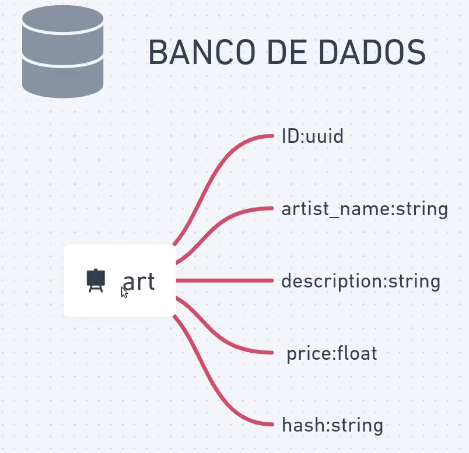

# Nftex
<p> Projeto de um painel para controle de gerenciamento de criptomoedas </p>

## Requirements
- [**Git**](https://git-scm.com/) para clonar o projeto.
- [**Elixir**](https://elixir-lang.org) 

### Running Code
* Dev Mode
```
npm start
```

* Dev Mode
```
npm dev
```

## Database Model
<p>
  <!--  -->
  
</p>